# Deep Diffusion Maps

[](https://opensource.org/licenses/MIT)

A novel implementation of diffusion maps using deep learning (neural networks). This repository contains the code for the experiments described in our paper [Paper Title].

## Overview

Diffusion Maps is a dimensionality reduction technique that preserves the diffusion distance between data points. This implementation extends the traditional diffusion maps algorithm by using neural networks to learn the embedding, which allows for:

1. **Out-of-sample extension**: Apply the learned embedding to new data points without recomputing the entire diffusion map
2. **Scalability**: Handle larger datasets more efficiently than traditional methods
3. **Integration with deep learning pipelines**: Easily incorporate diffusion maps into existing neural network architectures

Our approach combines the theoretical guarantees of diffusion maps with the flexibility and scalability of neural networks.

## Key Features

- **TensorFlow Implementation**: Custom loss function (`DiffusionLoss`) implemented as a TensorFlow Keras loss
- **Comparative Analysis**: Experiments comparing traditional diffusion maps, deep diffusion maps, and Nyström extension
- **Multiple Datasets**: Implementations for synthetic datasets (Swiss Roll, S-Curve, Helix) and real-world datasets (MNIST, Phoneme)
- **Comprehensive Metrics**: Evaluation using mean absolute error (MAE) and mean relative error (MRE) of pairwise distances
- **Visualization Tools**: Utilities for visualizing embeddings, eigenvalue decay, and error metrics

## Installation

To install all the dependencies, create a conda environment using:

```bash
conda env create -f experiments/environment.yml
```

This will create an environment named `ddm` with all the required packages.

Additionally, you may need to install LaTeX to create publication-quality plots.

## Usage

### Basic Usage

1. Activate the conda environment:

```bash
conda activate ddm
```

2. Run an experiment (e.g., Swiss Roll):

```bash
python -m experiments.swiss_roll.experiment -c experiments/swiss_roll/config.yml
python -m experiments.swiss_roll.plot_results -c experiments/swiss_roll/config.yml
```

3. Run all experiments:

```bash
bash experiments/run_experiments.sh
```

### Custom Implementation

To use the `DiffusionLoss` in your own projects:

```python
import tensorflow as tf
from diffusionloss import DiffusionLoss

# Prepare your data
X_train = ...  # Your training data

# Create the loss function
diffusion_loss = DiffusionLoss(
    X=X_train,
    sigma=0.1,  # Kernel bandwidth
    steps=10,   # Number of diffusion steps
    alpha=1.0   # Alpha parameter for normalization
)

# Create a model
model = tf.keras.Sequential([
    tf.keras.layers.Dense(128, activation='relu'),
    tf.keras.layers.Dense(64, activation='relu'),
    tf.keras.layers.Dense(2)  # Output dimension
])

# Compile with the diffusion loss
model.compile(optimizer='adam', loss=diffusion_loss)

# Train the model
# Note: y_train should be the indices of the training samples
indices = np.arange(len(X_train))
model.fit(X_train, indices, epochs=100, batch_size=32)

# Use the trained model for embedding new data
X_new = ...  # New data
embeddings = model.predict(X_new)
```

## Experiments

The repository includes experiments on several datasets. Each experiment compares three approaches:
1. **Traditional Diffusion Maps**: The standard algorithm
2. **Deep Diffusion Maps**: Our neural network implementation
3. **Nyström Extension**: A method for out-of-sample extension with traditional diffusion maps

### Datasets

#### Synthetic Datasets

- **Swiss Roll**: A 2D manifold embedded in 3D space, commonly used to evaluate manifold learning algorithms
- **S-Curve**: Another 2D manifold embedded in 3D space with a different topology
- **Helix**: A 1D manifold embedded in 3D space, forming a helix shape

#### Real-world Datasets

- **MNIST**: Handwritten digit dataset, used to evaluate the method on image data
- **Phoneme**: Speech dataset, used to evaluate the method on sequential data

### Neural Network Architectures

The repository includes several neural network architectures for different types of data:

- **MLP**: For tabular data (used in synthetic datasets)
- **CNN**: For image data (used in MNIST)
- **RNN/LSTM**: For sequential data (used in Phoneme)

## Configuration

Each experiment has a configuration file (`config.yml`) with the following parameters:

```yaml
data:
  npoints: 2000        # Number of data points
  split: 0.5           # Train/test split ratio
  noise: 0.0           # Noise level
  seed: 123            # Random seed
diffusion_maps:
  n_components: 2      # Number of dimensions in the embedding
  quantile: 5.0e-3     # Quantile for sigma estimation
  alpha: 1             # Alpha parameter for normalization
  steps: 100           # Number of diffusion steps
encoder:
  architecture: # This section may change depending on the data type
    units: 128         # Number of units in the hidden layers
    use_bn: False  # Whether to use batch normalization
  optimizer:
    learning_rate: 0.01  # Learning rate for the optimizer
  training:
    epochs: 5000       # Number of training epochs
    batch_size: 512    # Batch size
    validation_split: 0.1  # Validation split
    shuffle: True      # Whether to shuffle the data
    verbose: 2         # Verbosity level
output_dir: /path/to/output  # Output directory
```

You can modify these parameters to customize the experiments.

## Results

The experiments produce several outputs:

- **Embeddings**: The reduced-dimensional representations of the data
- **Eigenvalues and Log-likelihood**: Plots showing the eigenvalue decay and log-likelihood curves
- **Error Metrics**: MAE and MRE of pairwise distances, binned by distance deciles
- **Training History**: Loss curves for the neural network training

### Example visualizations

#### Swiss Roll
<div align="center">
  <table>
    <tr>
      <td align="center" width="25%">
        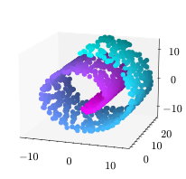<br>
        <b>Original (test)</b>
      </td>
      <td align="center" width="25%">
        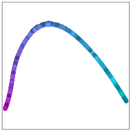<br>
        <b>Diffusion Maps</b>
      </td>
      <td align="center" width="25%">
        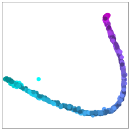<br>
        <b>Deep Diffusion Maps</b>
      </td>
      <td align="center" width="25%">
        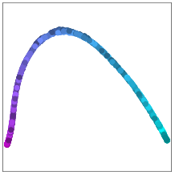<br>
        <b>Nyström</b>
      </td>
    </tr>
  </table>
</div>

#### S Curve
<div align="center">
  <table>
    <tr>
      <td align="center" width="25%">
        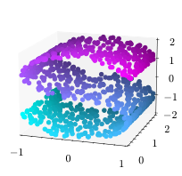<br>
        <b>Original (test)</b>
      </td>
      <td align="center" width="25%">
        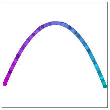<br>
        <b>Diffusion Maps</b>
      </td>
      <td align="center" width="25%">
        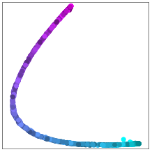<br>
        <b>Deep Diffusion Maps</b>
      </td>
      <td align="center" width="25%">
        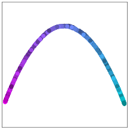<br>
        <b>Nyström</b>
      </td>
    </tr>
  </table>
</div>

#### Helix
<div align="center">
  <table>
    <tr>
      <td align="center" width="25%">
        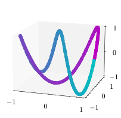<br>
        <b>Original (test)</b>
      </td>
      <td align="center" width="25%">
        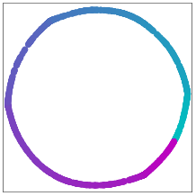<br>
        <b>Diffusion Maps</b>
      </td>
      <td align="center" width="25%">
        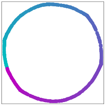<br>
        <b>Deep Diffusion Maps</b>
      </td>
      <td align="center" width="25%">
        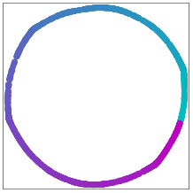<br>
        <b>Nyström</b>
      </td>
    </tr>
  </table>
</div>

#### Phoneme
<div align="center">
  <table>
    <tr>
      <td align="center" width="25%">
        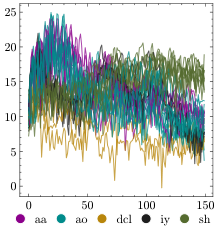<br>
        <b>Original (test)</b>
      </td>
      <td align="center" width="25%">
        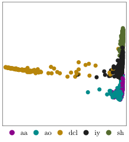<br>
        <b>Diffusion Maps</b>
      </td>
      <td align="center" width="25%">
        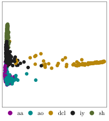<br>
        <b>Deep Diffusion Maps</b>
      </td>
      <td align="center" width="25%">
        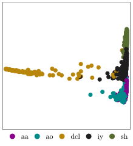<br>
        <b>Nyström</b>
      </td>
    </tr>
  </table>
</div>

#### MNIST
<div align="center">
  <table>
    <tr>
      <td align="center" width="25%">
        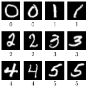<br>
        <b>Original (test)</b>
      </td>
      <td align="center" width="25%">
        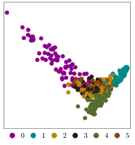<br>
        <b>Diffusion Maps</b>
      </td>
      <td align="center" width="25%">
        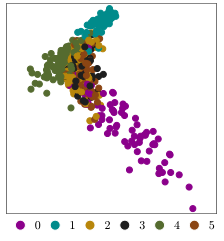<br>
        <b>Deep Diffusion Maps</b>
      </td>
      <td align="center" width="25%">
        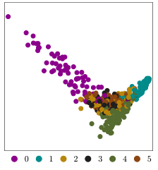<br>
        <b>Nyström</b>
      </td>
    </tr>
  </table>
</div>

## References

- Paper: [Paper Title]
- Diffusion Maps code implementation: [diffusion-maps-with-nystrom](https://github.com/sgh14/diffusion-maps-with-nystrom.git)
- Original Diffusion Maps paper: Coifman, R. R., & Lafon, S. (2006). Diffusion maps. Applied and computational harmonic analysis, 21(1), 5-30.

## License

This project is licensed under the MIT License - see the LICENSE file for details.

## Contact

If you have any questions or comments, please do not hesitate to contact us.